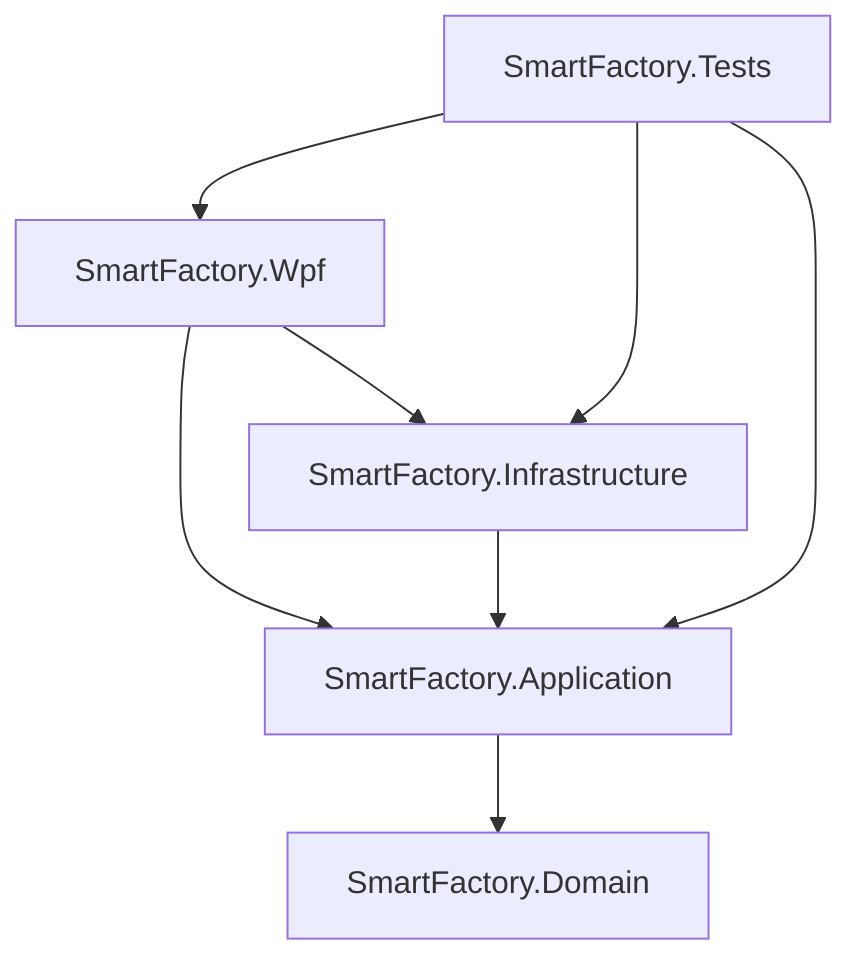

# SmartFactory.Desktop

面向智能制造现场的 WPF 智能产线设备监控与运维平台。项目可以完全离线运行，以 SQLite 保存业务数据，以模拟实时设备源持续产生遥测，覆盖设备、报警、工单、历史与配置的完整演示链路。

## 快速启动

环境要求：Windows 10/11 与 .NET 8 SDK。原需求优先 .NET 10，本机最高稳定 SDK 为 8.0.202，因此项目按约定使用当前可用 LTS `net8.0` / `net8.0-windows`。

```powershell
dotnet restore SmartFactory.sln
dotnet build SmartFactory.sln
dotnet test SmartFactory.sln
dotnet run --project SmartFactory.Wpf
```

首次启动自动创建 `%LocalAppData%\SmartFactory\smartfactory.db`，无需执行迁移或手工建库。用户设置保存到同目录的 `user-settings.json`。

| 角色 | 用户名 | 密码 | 典型权限 |
|---|---|---|---|
| Administrator | `admin` | `admin123` | 全部功能 |
| Engineer | `engineer` | `engineer123` | 设备编辑、报警确认、工单编辑、历史查询 |
| Operator | `operator` | `operator123` | 只读监控、报警、工单和历史 |

> 演示账号使用 SHA-256 本地摘要以避免明文入库；生产认证应替换为服务端身份提供商、加盐慢哈希和安全令牌体系。

## 技术栈

- WPF、XAML、C#、.NET 8
- CommunityToolkit.Mvvm：`ObservableObject`、`ObservableValidator`、`ObservableProperty`、`RelayCommand`、`AsyncRelayCommand`
- Generic Host、依赖注入、Options 配置、Microsoft Logging
- EF Core 8、SQLite、`IDbContextFactory<T>`、`AsNoTracking`
- `IAsyncEnumerable<T>`、`PeriodicTimer`、`ConcurrentDictionary`、`CancellationToken`
- `ICollectionView` 搜索过滤、DataTemplate 导航、DependencyProperty、自定义控件
- xUnit；测试不启动完整窗口

## 解决方案架构

```text
SmartFactory.sln
├─ SmartFactory.Domain          纯实体、枚举；不引用 UI、EF 或网络
├─ SmartFactory.Application     接口、分页、Options、应用异常、业务服务
├─ SmartFactory.Infrastructure  EF Core、Repository、SQLite、认证、模拟器、REST 客户端
├─ SmartFactory.Wpf             Host、DI、ViewModel、View、样式、Dispatcher、对话框
└─ SmartFactory.Tests           Application / ViewModel / 实时算法测试
```



依赖方向保持为外层依赖内层。Domain 不知道 WPF、数据库、网络和 Dispatcher；ViewModel 只依赖 Application 接口，默认离线实现可替换为 REST/WebSocket、SignalR、MQTT 或 OPC UA 适配器。

## 数据流与生命周期

普通业务：

```text
View → Binding / Command → ViewModel → Application Service → Repository → SQLite / API
```

实时业务：

```text
Simulated Device Source
  → IAsyncEnumerable<DeviceTelemetry>
  → ConcurrentDictionary（按 DeviceId 保留最新值）
  → PeriodicTimer（200ms）
  → 一批最新快照
  → IUiDispatcher.InvokeAsync
  → DeviceItemViewModel / INotifyPropertyChanged
  → WPF Binding
```

应用启动由 Generic Host 负责：构建 DI 与配置 → 启动 Host → 自动初始化 SQLite 和种子数据 → 显示登录窗口。离开设备页面会取消实时订阅并等待后台任务结束；应用退出时停止 Host 并释放资源。全局 UI、AppDomain 与未观察任务异常仅作日志兜底，业务异常仍在服务和 ViewModel 边界处理。

## 业务功能

- 登录：离线认证、加载态、错误信息、三个演示角色。
- 生产总览：设备总数、在线/离线/故障、今日报警、Critical 报警、待处理工单、最近报警，全部来自 SQLite。
- 设备监控：搜索、状态过滤、刷新、新增、编辑、删除、详情；温度、压力、转速实时刷新。
- 报警中心：级别过滤、搜索、确认、服务端分页模型；阈值引擎与同设备同类型 30 秒冷却去重。
- 运维工单：搜索、分页、新建、编辑、删除、开始、完成；`ObservableValidator` 展示字段级错误。
- 历史数据：设备和日期范围查询，每页 50 条，只读取当前页。
- 系统设置：UI 刷新周期、模拟器开关、温度阈值与主题扩展位；配置写入本地文件。
- API 扩展：`DeviceApiClient` 使用 `IHttpClientFactory`，默认不访问外部服务器。

## 数据库设计

SQLite 表包括 `Devices`、`Alarms`、`WorkOrders`、`TelemetryRecords`、`Users`、`Roles`。设备编号、用户名和工单号建立唯一索引；报警时间/设备与遥测设备/时间建立组合索引。Repository 每次操作由 `IDbContextFactory<AppDbContext>` 创建短生命周期上下文；读查询默认 `AsNoTracking`。

首次初始化是幂等的：存在设备数据即不重复灌入。种子包含 8 台指定设备、36 条报警、3 张工单、1,440 条历史遥测与三个角色账号。

## RBAC

`CurrentUserService` 保存当前用户与解析后的权限集合。导航项按读取权限生成，编辑和确认命令通过 `CanExecute` 控制，Service 在关键写操作前再次检查权限。

客户端 RBAC 不是安全边界。隐藏按钮和禁用命令只能改善体验；生产系统必须在服务端对每个 API 请求重新认证和授权，不能相信客户端提交的角色或用户标识。

## WPF 与性能设计

- `ContentControl + CurrentViewModel + DataTemplate` 完成单窗口页面导航，不为每个菜单创建新 Window。
- `ICollectionView` 在原集合上执行设备搜索与状态过滤，输入字符时不重建 `ObservableCollection`。
- DataGrid 开启行虚拟化、Recycling 与逻辑滚动；历史和报警同时采用数据分页。
- `DeviceStatusCard` 暴露 `Title`、`Value`、`Status` 三个 DependencyProperty，并实际用于首页卡片。
- 状态颜色由 Converter / ResourceDictionary 处理，ViewModel 不返回 `Brush`。
- `IUiDispatcher` 隔离 WPF Dispatcher，测试使用同步实现。
- 实时采集与 UI 刷新解耦；一个设备在刷新窗口内产生多条值时只绘制最后一条。
- 页面离开取消 `IAsyncEnumerable`、`PeriodicTimer` 和后台任务；窗口事件在关闭时退订，降低长生命周期引用风险。

UI Virtualization 只减少已加载集合的控件实例和绘制成本；Data Virtualization / 服务端分页减少真正加载到内存和通过 IO 传输的数据量。两者解决不同层次的问题，本项目在 DataGrid 和历史/报警查询中分别使用。


## 测试

测试覆盖：DeviceService 查询、AlarmService 确认、RBAC、登录成功、登录失败、设备刷新、`ICollectionView` 搜索、工单验证、报警阈值和遥测聚合。Fake/Stub 手写实现，未启动 WPF Window。

## 当前限制与扩展方向

- 当前实时源为单机模拟器，REST 客户端仅作可编译替换点；未实现真实 OPC UA/MQTT/SignalR 连接。
- 本地设置已持久化，动态主题只保留扩展位；完整主题切换可改为替换动态 ResourceDictionary。
- 演示认证不适用于生产；生产环境需要服务端认证、审计、密钥管理和数据库迁移策略。
- 报警与设备状态跨页面同步可进一步抽象成后台 HostedService 与领域事件总线。
- 简化项目使用 `EnsureCreated` 保证零配置启动；持续演进时应切换为 EF Core Migrations。
